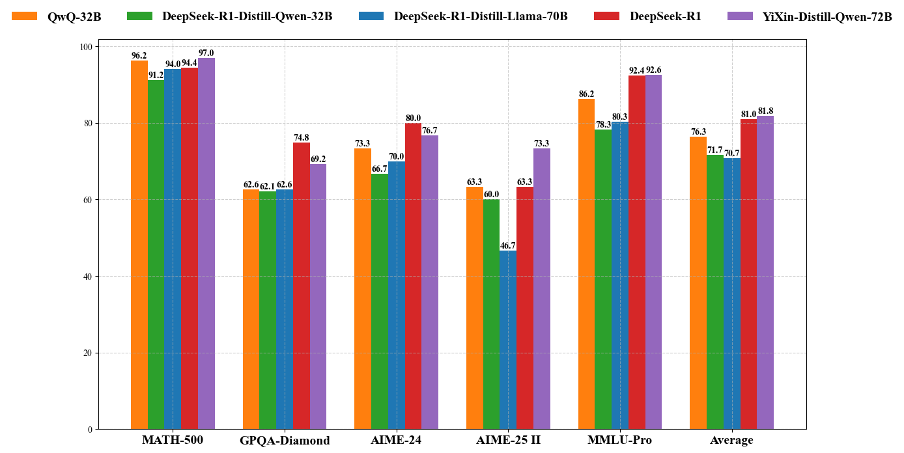

<div style="text-align: center;">
  <h1>YiXin-Distill-Qwen-72B</h1>
  
</div>

## Model Overview

**YiXin-Distill-Qwen-72B: A High-Performance Distilled Model for Mathematical and General Reasoning**, derived from Qwen2.5-72B using reinforcement learning. It is specifically optimized for mathematical reasoning and general knowledge tasks. Leveraging advanced distillation techniques, this model enhances reasoning capabilities while maintaining computational efficiency. Built upon the robust Qwen model foundation, it aims to achieve state-of-the-art performance across various benchmark evaluations.Our benchmark evaluations demonstrate that YiXin-Distill-Qwen-72B delivers strong performance, showing improvements over comparable distilled models in key mathematical and general reasoning tasks, with observed average improvements of 5 to 11 percentage points.
## Training Details

### Data Collection and Processing

YiXin-Distill-Qwen-72B is trained on a carefully curated, high-quality dataset designed to improve mathematical reasoning and general knowledge comprehension. The data pipeline follows a structured multi-stage approach to ensure optimal model performance while minimizing noise.

#### 1. **Dataset Aggregation**

- Built upon currently available high-quality open-source datasets.
- Covers multiple domains, including **mathematics and general knowledge**.

#### 2. **Data Filtering and Quality Assessment**

We implemented a comprehensive quality control framework utilizing DeepSeek-R1 as an LLM judge to evaluate data quality. The assessment criteria included:
- **Difficulty Level**: Data samples were categorized into simple, moderate, and difficult tiers to ensure balanced representation across complexity levels.
- **Ground Truth** Verification: We employed rigorous verification processes to ensure the correctness of answers within the dataset.
- **Quality Scoring**: Each prompt-response pair was evaluated based on its complexity, instructional clarity, and potential to enhance reasoning abilities.
- **Response Length Analysis**: Responses that failed to meet minimum length requirements were excluded, as they typically lacked sufficient information to provide meaningful training signals.

#### 3. **Validation and Refinement**

For subjective answers, we employed an LLM-based judge to validate response quality and relevance.
Mathematical content underwent additional validation procedures:
- Mathematical answers and their corresponding solutions were systematically validated.
- A critic model assessed each solution process to ensure logical consistency and correctness of mathematical reasoning.
- Solutions with logical gaps or incorrect reasoning patterns were either corrected or removed from the training set.

## Distillation Process

YiXin-Distill-Qwen-72B adopts a progressive two-stage distillation approach, iteratively refining model performance through intelligent data selection and optimization. The training framework continuously identifies and removes high-confidence samples—i.e., cases where the model already excels—to mitigate overfitting, while iteratively refining low-confidence samples to strengthen weak reasoning patterns. By leveraging multiple fine-tuning cycles and quality assessments, the model achieves a balanced enhancement of efficiency and accuracy across mathematical and general reasoning benchmarks.

## Evaluation Results

YiXin-Distill-Qwen-72B was benchmarked against multiple models, including QwQ-32B, DeepSeek-R1-Distill-Qwen-32B, and DeepSeek-R1-Distill-Llama-70B, DeepSeek-R1, across mathematical reasoning and general knowledge tasks:



| Metric          | QwQ-32B | DeepSeek-R1-Distill-Qwen-32B | DeepSeek-R1-Distill-Llama-70B | DeepSeek-R1 | YiXin-Distill-Qwen-72B |
|---------------|-------------|-----------------------------|------------------------------|-------------|------------------------|
| MATH-500      | 96.2        | 91.2                        | 94.0                         | 94.4        | **97.0**               |
| GPQA-Diamond  | 62.6        | 62.1                        | 62.6                         | **74.8**    | 69.2                   |
| AIME-24       | 73.3        | 66.7                        | 70.0                         | **80.0**    | 76.7                   |
| AIME-25       | 63.3        | 60.0                        | 46.7                         | 63.3        | **73.3**               |
| MMLU-Pro      | 86.2        | 78.3                        | 80.3                         | 92.4        | **92.6**               |
| **Average**   | 76.3        | 71.7                        | 70.7                         | 81.0        | **81.8**               |

YiXin-Distill-Qwen-72B demonstrates significant improvements across mathematical reasoning and general knowledge tasks.

## How to Run Locally

### Hugging Face's Transformers

```python
from transformers import AutoModelForCausalLM, AutoTokenizer
model_name = "YiXin-AILab/YiXin-Distill-Qwen-72B"
model = AutoModelForCausalLM.from_pretrained(
    model_name,
    torch_dtype="auto",
    device_map="auto"
)
tokenizer = AutoTokenizer.from_pretrained(model_name)
prompt = "8+8=?"
messages = [
    {"role": "system", "content": "You are a helpful and harmless assistant. You are Qwen developed by Alibaba. You should think step-by-step."},
    {"role": "user", "content": prompt}
]
text = tokenizer.apply_chat_template(
    messages,
    tokenize=False,
    add_generation_prompt=True
)
model_inputs = tokenizer([text], return_tensors="pt").to(model.device)
generated_ids = model.generate(
    **model_inputs,
    max_new_tokens=512
)
generated_ids = [
    output_ids[len(input_ids):] for input_ids, output_ids in zip(model_inputs.input_ids, generated_ids)
]
response = tokenizer.batch_decode(generated_ids, skip_special_tokens=True)[0]
```

### vLLM or SGLang

For instance, you can easily start a service using [vLLM](https://github.com/vllm-project/vllm):

```shell
vllm serve YiXin-AILab/YiXin-Distill-Qwen-72B --tensor-parallel-size 4 --max-model-len 32768 --enforce-eager
```

You can also easily start a service using [SGLang](https://github.com/sgl-project/sglang)

```bash
python3 -m sglang.launch_server --model YiXin-AILab/YiXin-Distill-Qwen-72B --trust-remote-code --tp 4 --port 8000
```

Then you can access the Chat API by:

```bash
curl http://localhost:8000/v1/chat/completions \
    -H "Content-Type: application/json" \
    -d '{
    "model": "YiXin-AILab/YiXin-Distill-Qwen-72B",
    "messages": [
        {"role": "system", "content": "You are a helpful and harmless assistant. You are Qwen developed by Alibaba. You should think step-by-step."},
        {"role": "user", "content": "8+8=?"}
    ]
    }'
```

## Limitations

Despite its strong performance, YiXin-Distill-Qwen-72B has certain limitations:

- **Potential Security Concerns:** YiXin-Distill-Qwen-72B may be vulnerable to adversarial attacks, prompt injection, and data leakage. Proper security measures are recommended for sensitive deployments.
- **Domain-Specific Biases:** Performance may vary across different domains, particularly those underrepresented in the training data.
- **Potential Loss in Distillation:** Some nuanced reasoning capabilities from the teacher model may be reduced during the distillation process.

## Citation

If you use YiXin-Distill-Qwen-72B in your research, please cite this work appropriately:

```bibtex
@misc{yixindistillqwen-72b,
  title={YiXin-Distill-Qwen-72B: A High-Performance Distilled Model for Mathematical and General Reasoning},
  author={YiXin-AILab},
  year={2025},
  url={https://huggingface.co/YiXin-AILab/YiXin-Distill-Qwen-72B}
}
```

## Acknowledgments

We acknowledge the contributions of the open-source community and researchers who have developed and maintained the Qwen and DeepSeek models. Their work has significantly advanced the field of large language model distillation and reasoning capabilities.
